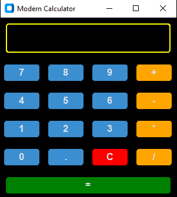

## 🧮 PYTHON GUI CALCULATOR

A clean, user-friendly calculator made with **Python** and **Tkinter**. It performs basic math operations using a graphical interface with clickable buttons — perfect for beginners and quick calculations!

## ⚙️ FEATURES
- Simple and intuitive GUI
- Supports Addition (+), Subtraction (−), Multiplication (×), Division (÷)
- Real-time input and result display
- Clear (`C`) and Equal (`=`) buttons

## 🛠 TECH STACK
- 🐍 Python 3.x  
- 🖼️ Tkinter (Python’s built-in GUI library)

## ▶️ HOW TO RUN
1. Ensure Python is installed.
2. Save the script as `calculator.py`.
3. Open terminal or command prompt and run:
   ```bash
   python calculator.py
   ```

## 🖼️ SCREENSHOT



## 📦 OPTIONAL SETUP FILE
If you'd like to build an installable `.exe` version:

1. Make sure `setup2.py` is in the same folder.
2. Run it using:
   ```bash
   python setup2.py build
   ```
3. The executable will be created in the `dist/` folder.

*Note: You must have `pyinstaller` installed.*

## 📁 FILE STRUCTURE
1. Calculator.py 
2. setup2.py
3. README.md 
4. calculator.png

## 👤 AUTHOR  
Vinamra Gupta
